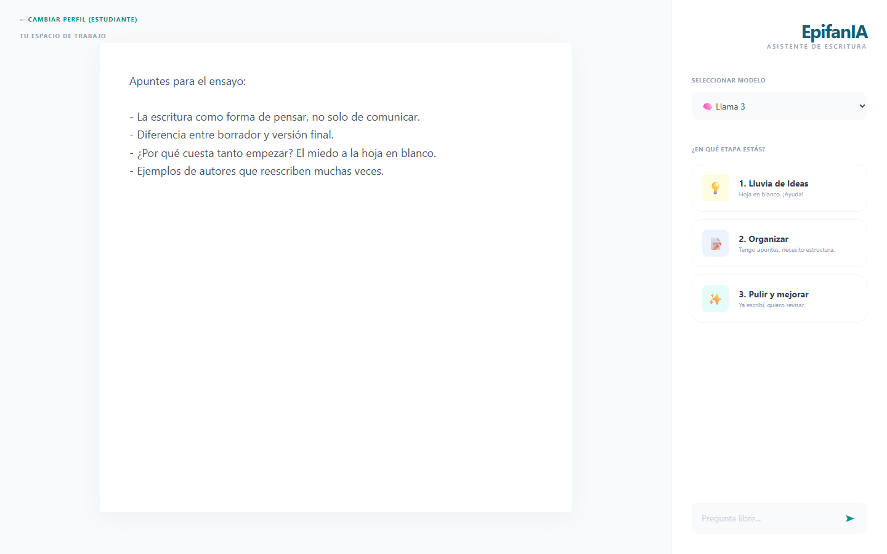
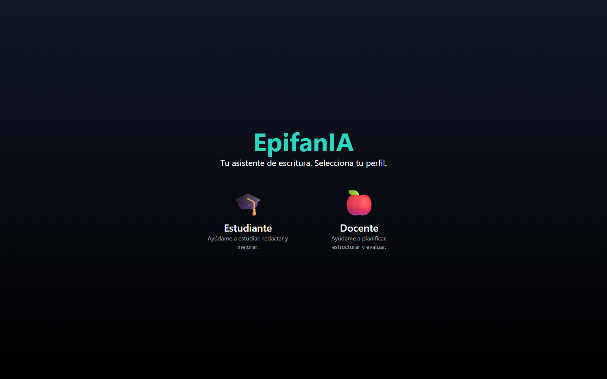

# EpifanIA

[English](README.md) · **Español**

Un asistente de escritura que ejecuta modelos de lenguaje **completamente en la propia computadora**. Sin conexión a internet, sin claves de API, y el texto nunca sale de la máquina.



## Características

- **Dos modelos, dos roles.** Permite alternar entre una *editora* precisa (Llama 3.1, temperatura baja) y una *musa* creativa (Hermes 3, temperatura alta) según lo que se necesite.
- **Ayuda por etapas.** Lluvia de ideas desde la hoja en blanco, organización de apuntes en una estructura, o pulido de un borrador terminado.
- **Carga de modelos según la memoria.** Solo se mantiene un modelo en la memoria de la GPU; al cambiar de modelo se descarga el anterior para entrar en 8 GB de VRAM.
- **Editor minimalista.** Una superficie de escritura sin distracciones, con las sugerencias en una tarjeta flotante.

## Tecnologías

- **Backend:** Python, FastAPI, [llama-cpp-python](https://github.com/abetlen/llama-cpp-python) con CUDA
- **Frontend:** React, Vite, Tailwind CSS
- **Modelos:** formato GGUF, cuantización de 4 bits (Q4_K_M)

## Estructura del proyecto

```
backend/
  main.py              Carga/descarga de modelos y endpoint de generación
frontend/
  src/App.jsx          Editor, selector de modelo y botones de etapa
  src/SelectorPerfil.jsx   Pantalla de selección de perfil
```

## Cómo correrlo

**Requisitos:** GPU NVIDIA con 8 GB de VRAM, Python 3.10+, Node.js 18+.

1. Instalar el backend:
   ```bash
   cd backend
   python -m venv .venv
   .venv\Scripts\activate
   pip install -r requirements.txt
   ```
   Para usar la GPU, instalar `llama-cpp-python` con CUDA habilitado — ver su [guía de instalación](https://github.com/abetlen/llama-cpp-python#installation).

2. Descargar ambos modelos en la carpeta `backend/`:
   - `Meta-Llama-3.1-8B-Instruct-Q4_K_M.gguf` — [bartowski/Meta-Llama-3.1-8B-Instruct-GGUF](https://huggingface.co/bartowski/Meta-Llama-3.1-8B-Instruct-GGUF)
   - `Hermes-3-Llama-3.1-8B.Q4_K_M.gguf` — [NousResearch/Hermes-3-Llama-3.1-8B-GGUF](https://huggingface.co/NousResearch/Hermes-3-Llama-3.1-8B-GGUF)
     → renombrarlo a `Hermes-3-Llama-3.1-8B-Q4_K_M.gguf` (el nombre que espera `main.py`)

3. Iniciar el backend:
   ```bash
   uvicorn main:app --reload
   ```

4. Iniciar el frontend (en otra terminal):
   ```bash
   cd frontend
   npm install
   npm run dev
   ```

## Limitaciones conocidas

- El perfil estudiante/docente se elige en la interfaz, pero el backend todavía no lo usa para adaptar las respuestas.
- Requiere una GPU NVIDIA dedicada; no hay alternativa configurada para CPU.


